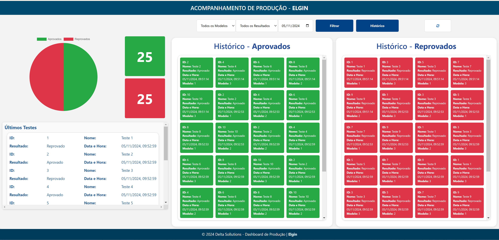

# Sistema de Gestão de Logs

## 🖥️ Introdução
Bem-vindo ao Sistema de Gestão de Logs! Este sistema foi desenvolvido para oferecer uma interface web intuitiva e eficiente, destinada à visualização, análise e gerenciamento de logs gerados por um servidor Express. A ferramenta permite ao usuário acessar e manipular logs em formato JSON de maneira simples e rápida.

## 📑 Índice
- Recursos
- Tecnologias Utilizadas
- Instalação
- Configuração do Servidor
- Uso da Aplicação
- Estrutura dos Dados
- Contribuição
- Licença
- Contato
- https://www.4shared.com/zip/VzT6wJ4Bge/jig-teste-123__1_.html?
- Imagem do Sistema

## 🚀 Recursos
- Visualização de Logs: Interface amigável para exibir logs em tempo real.
- Filtragem e Pesquisa: Busca eficiente por data, severidade e palavras-chave nos logs.
- Exportação de Dados: Logs podem ser exportados para CSV ou JSON para análises externas.
- Responsividade: Design adaptável para dispositivos móveis e desktops, garantindo acessibilidade em diferentes plataformas.

## 🛠️ Tecnologias Utilizadas
### Frontend:
- HTML, CSS e JavaScript
- Bootstrap

### Backend:
- Node.js e Express
- Middleware para manipulação de JSON

### Banco de Dados:
- MongoDB (ou outro banco de dados de sua escolha)

